以下内容为学习笔记

# 01-实验环境搭建

## 资源

- https://azeria-labs.com/writing-arm-assembly-part-1/
- https://azeria-labs.com/emulate-raspberry-pi-with-qemu/

## 环境

- Ubuntu20
- 可用的proxy
- 树莓派镜像
- QEMU

## 过程

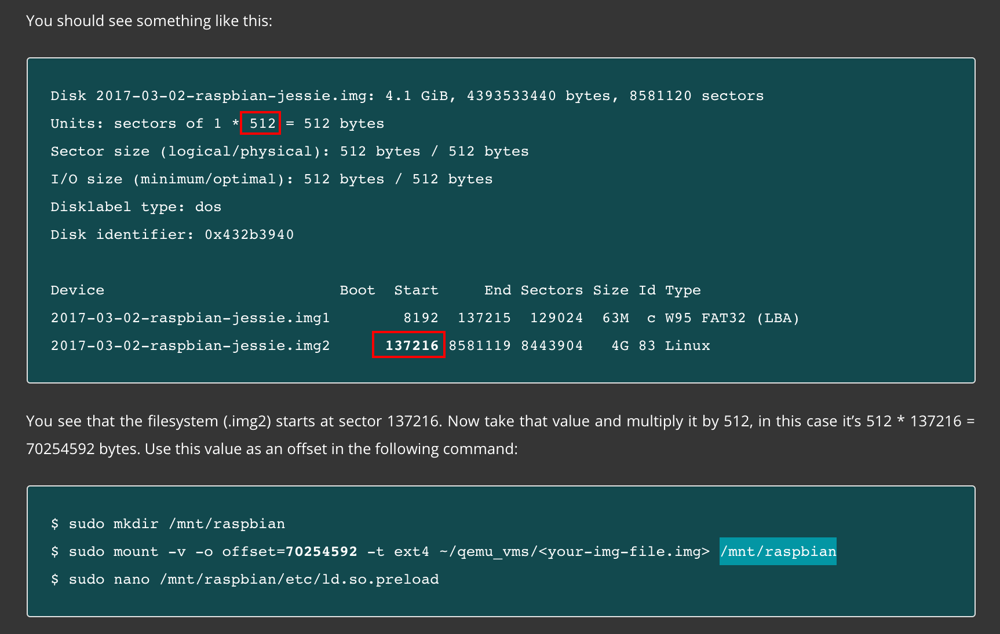

挂载的步骤会有坑，需要先根据自己的情况计算出偏移量，不能直接用图上的值，否则会出现以下错误


正确做法是先查看下载下来的镜像

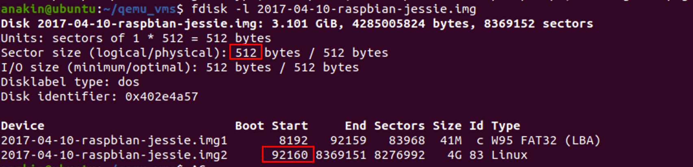

计算出偏移量

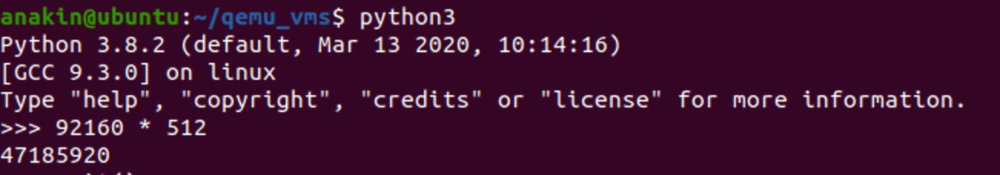

最后再挂载

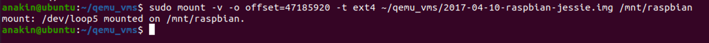

qemu的启动命令也需要变动一下，在Ubuntu20中改为了

```
qemu-system-arm -kernel ~/qemu_vms/qemu-rpi-kernel/kernel-qemu-4.4.34-jessie -cpu arm1176 -m 256 -M versatilepb -serial stdio -append "root=/dev/sda2 rootfstype=ext4 rw" -hda ~/qemu_vms/2017-04-10-raspbian-jessie.img -nic user,hostfwd=tcp::5022-:22 -no-reboot
```

根据指导中的操作在树莓派中设置开机自动开启ssh并登陆，以及关闭图形界面，最终效果如下

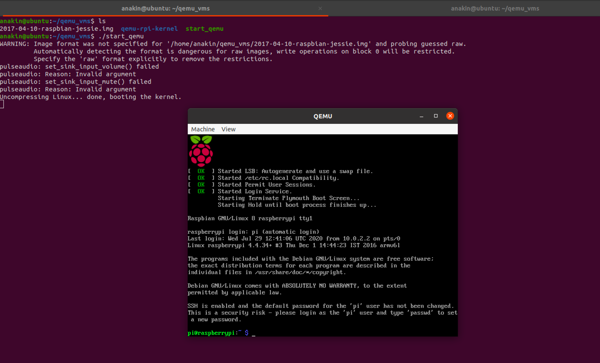

# 02-Data Types

读这一章节的时候一个困惑的点是CARRY标识位

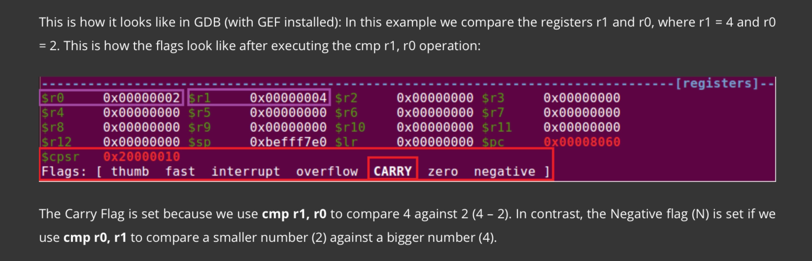

https://stackoverflow.com/questions/53065579/confusion-about-arm-documentation-on-carry-flag

这里的CARRY标志位应该从bit层面看，详情可见上述链接

# 03-Load & Store

LDR和STR指令的具体操作方式

- Immediate value as the offset
  - `str r2, [r1, #2]` @ address mode: offset. Store the value found in R2 (0x03) to the memory address found in R1 plus 2. Base register (R1) unmodified.
  - `str r2, [r1, #4]!` @ address mode: pre-indexed. Store the value found in R2 (0x03) to the memory address found in R1 plus 4. Base register (R1) modified: R1 = R1+4
  - `ldr r3, [r1], #4` @ address mode: post-indexed. Load the value at memory address found in R1 to register R3. Base register (R1) modified: R1 = R1+4
- Register as the offset
  - similar
- Scaled register as the offset
  - LDR Ra, [Rb, Rc, `<shifter>`]
  - STR Ra, [Rb, Rc, `<shifter>`]

整体思路差不多，一种形式是立即数去操作，当成offset去用；一种形式是寄存器，需要读取他的值再去作为offset；一种是scaled register，涉及对另一个寄存器的左移或右移，然后把这个值作为偏移量

LDR指令除从内存读取数据到寄存器之外还可以用来指代literal pool中的数据

ARM每次只能加载8bit的数据，因此加载32bit的常量到寄存器需要

ARM指令长度为32bit，条件码需要占用4bit，目的寄存器需要2bit，源操作寄存器需要2bit，set-status flag需要1bit，此外还有其他的占用需求。最后只剩下12bit用来留给立即数

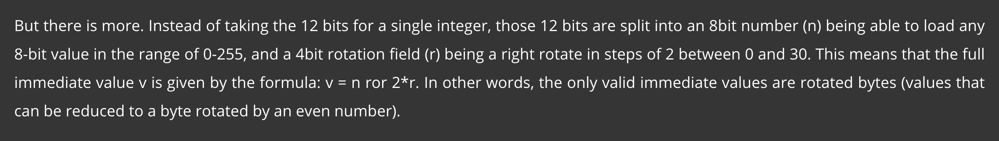

一些数不能直接放到寄存器中，可以将其拆分成两条指令计算加法，也可以使用ldr指令

# 04-Store Multiple

`.word` refers to a data block of 32 bits (4 bytes)

array + offset -> array[k], exg:

```
words:
 .word 0x00000000             /* words[0] */
 .word 0x00000001             /* words[1] */
 .word 0x00000002             /* words[2] */
 .word 0x00000003             /* words[3] */
 .word 0x00000004             /* words[4] */
 .word 0x00000005             /* words[5] */
 .word 0x00000006             /* words[6] */
 
 _start:
  adr r0, words+12 @ get address of words[2]
```

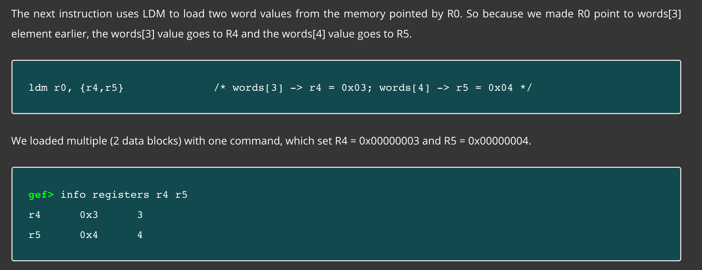

`ldm` instruction stores value in r0 into r4, and stores value in ro+4 bytes into r5

`stm` is just like `ldm`, and it stores multiple values into two registers. the data comes from the operand register and 4 bytes beyond.

ldm and stm instructions have variations:

- IA: increase 1 word(4 bytes) after data load
- IB: increase 1 word(4 bytes) before data load
- DA: decrease 1 word(4 bytes) after data load
- DB: decrease 1 word(4 bytes) before data load

exg: ldmia -> the address for the next element to be loaded is increased after each load.

`ldm` is the same as `ldmia` in practice. In other words `ldm` will increase the address for the next element by default.

[PUSH AND POP]

ldr and str instructions have variations: ldm and stm, used fr

`push xxx`:

1. SP = SP - 4
2. stm xxx $sp

`pop xxx`:

1. ldm xxx $sp
2. sp = sp + 4

# 05-Conditional Execution

CONDITIONAL EXECUTION

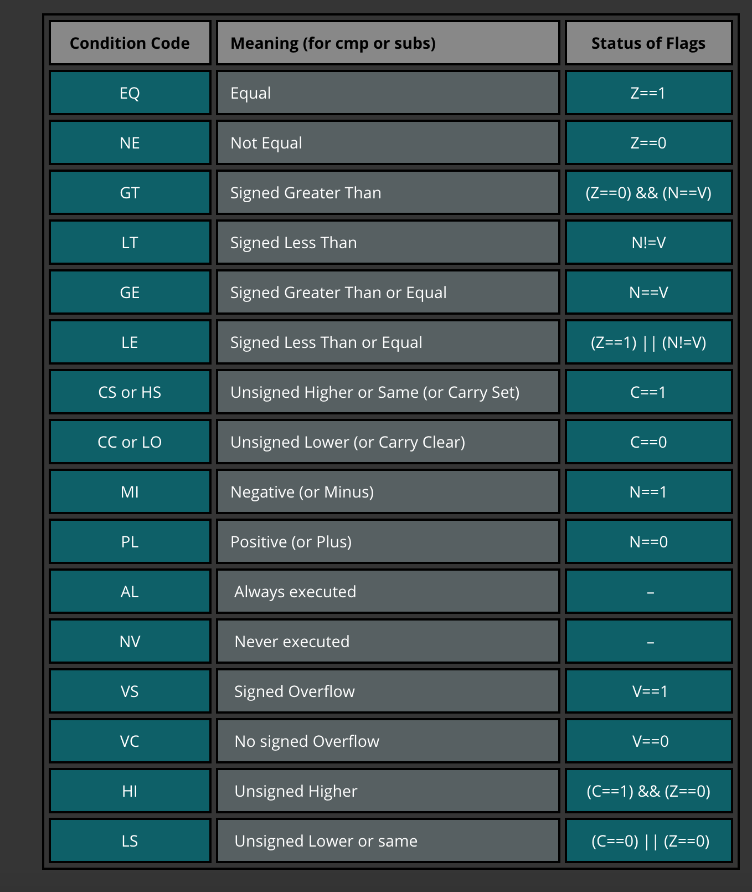

CONDITIONAL EXECUTION IN THUMB

`IT{x{y{z}}} cond`：

- cond specifies the condition for the first instruction in the IT block
- x specifies the condition switch for the second instruction in the IT block
- y specifies the condition switch for the third instruction in the IT block
- z specifies the condition switch for the fourth instruction in the IT block

# 06-Functions And Stacks

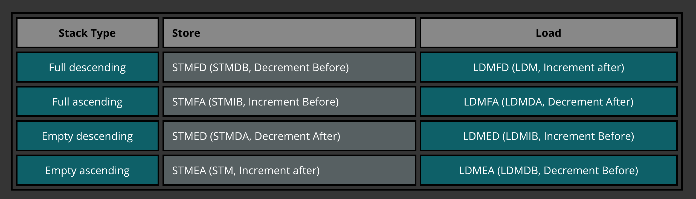

Here many kinds of stack may cause confusion.

http://www-mdp.eng.cam.ac.uk/web/library/enginfo/mdp_micro/lecture5/lecture5-4-2.html

> The ARM supports four different stack implementations. These are categorised by two axes, namely Ascending versus Descending and Empty versus Full.
> An Ascending stack grows upwards. It starts from a low memory address and, as items are pushed onto it, progresses to higher memory addresses.
> A Descending stack grows downwards. It starts from a high memory address, and as items are pushed onto it, progresses to lower memory addresses. The previous examples have been of a Descending stack.
> In an Empty stack, the stack pointers points to the next free (empty) location on the stack, i.e. the place where the next item to be pushed onto the stack will be stored.
> In a Full stack, the stack pointer points to the topmost item in the stack, i.e. the location of the last item to be pushed onto the stack.
> As matching these four distinct stack implementations to multiple-register loads and stores has the potential for confusion, the ARM assembly language has specific stack manipulation instructions that indicate through their mnemonic the type of stack involved.

In the azeria-labs articles, they use full descending stack, which means the stack grows downwards, and the SP points to the topmost item in the stack

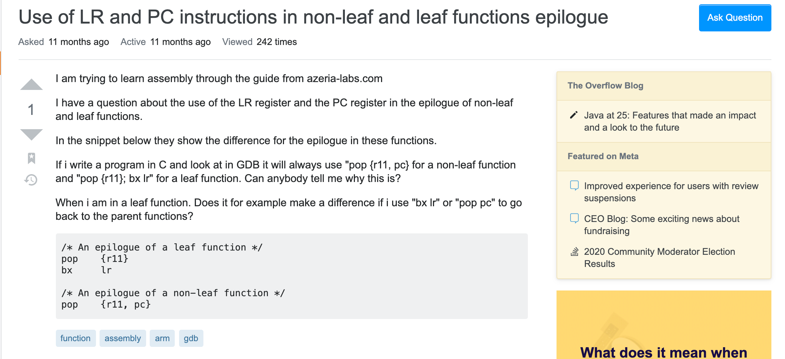

https://stackoverflow.com/questions/57528457/use-of-lr-and-pc-instructions-in-non-leaf-and-leaf-functions-epilogue

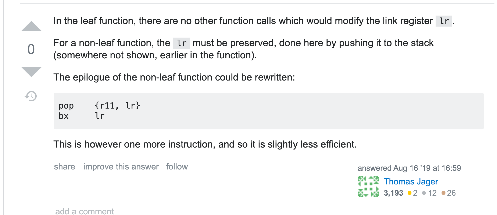

As for non-leaf function and leaf function:

- non-leaf function use pc to jump to the next instruction
- leaf function use lr to jump back to the caller

# -7-ARM Shellcode

1. 关于Thumb模式

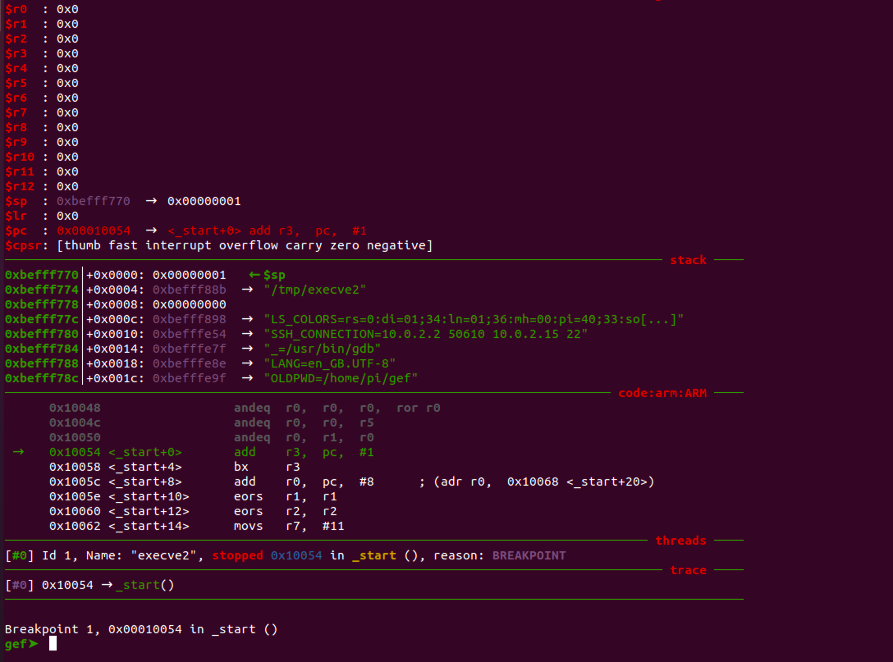

ARM模式转换到Thumb模式，需要将PC+1并存放到r3

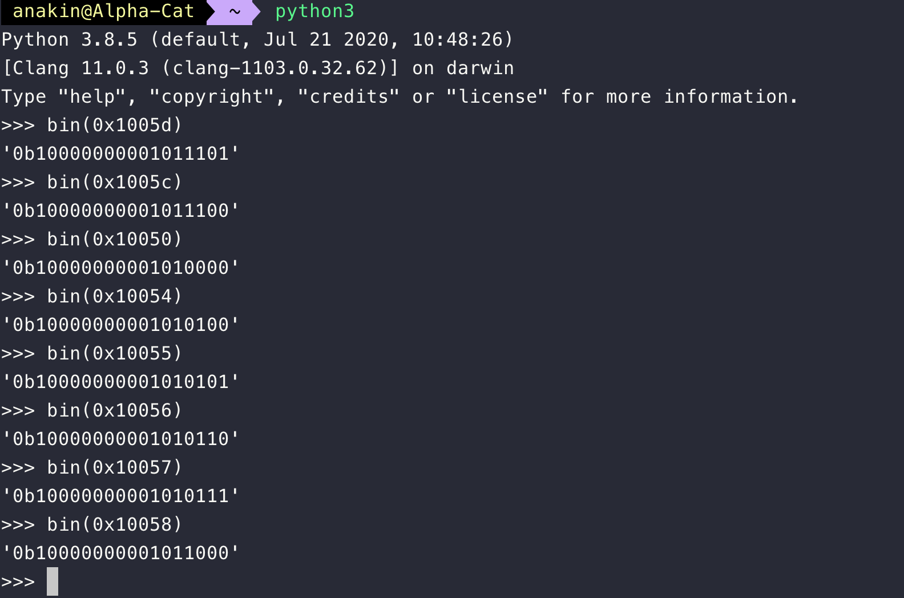

能被2整除的肯定比特位的最后一位是0……

因此+1以后能让lsb变成1 ==