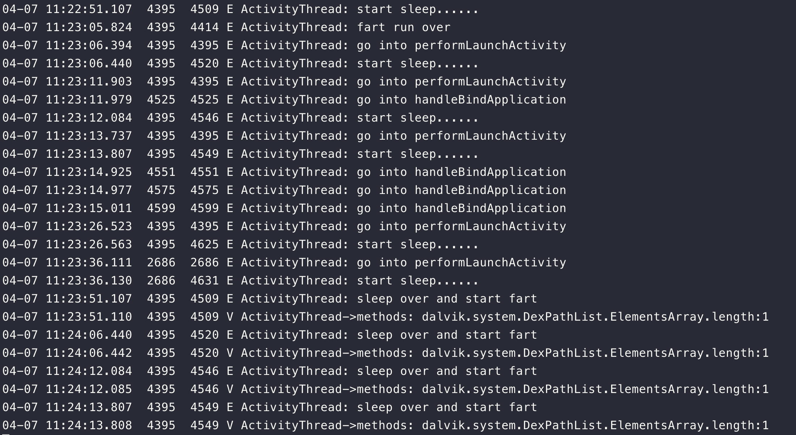
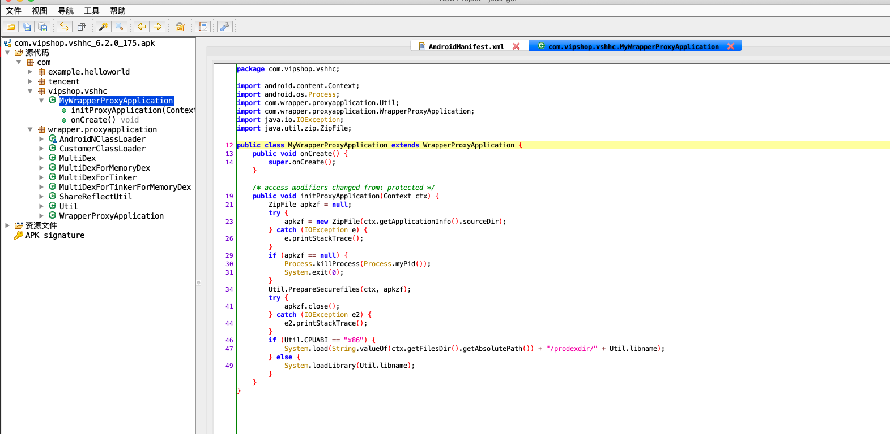
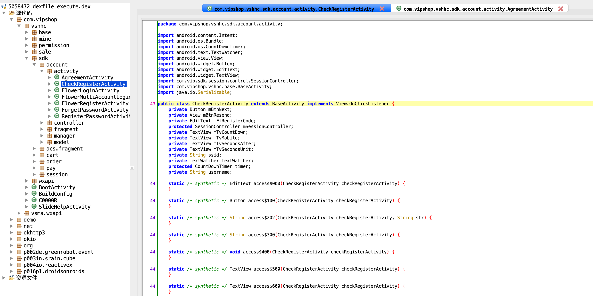

## 相关材料

* https://www.anquanke.com/post/id/199898#h3-11
* https://www.anquanke.com/post/id/201896

## 线刷

机型是刚买的pixel2，考虑到谷歌亲儿子更方便折腾还是买了pixel

记录流程：

1. 开启pixel开发者模式，打开usb调试
2. `adb reboot bootloader`
3. `fastboot flashing unlock`
4. 解锁后开启usb调试，再次进入bootloader
5. `./flash-all.sh`即可

## 使用

1. 编写fart工具配置文件/data/fart，第一行是包名，第二行是私有目录，设置777权限
2. 安装应用，启动应用，会在私有目录下生成dump下的dex和函数体文件
3. 拷贝下相关文件，运行修复脚本

脱壳前

脱壳后

效果非常好，想要的包都出来了。推荐继续阅读一下hanbing大佬写的三篇关于原理分析的文章