## Shiro-550

### 环境搭建

漏洞环境：https://github.com/Medicean/VulApps/tree/master/s/shiro/1

```
docker pull medicean/vulapps:s_shiro_1
docker run -d -p 8081:8080 medicean/vulapps:s_shiro_1
```

### 原理分析

环境启动后有这样一个实例页面

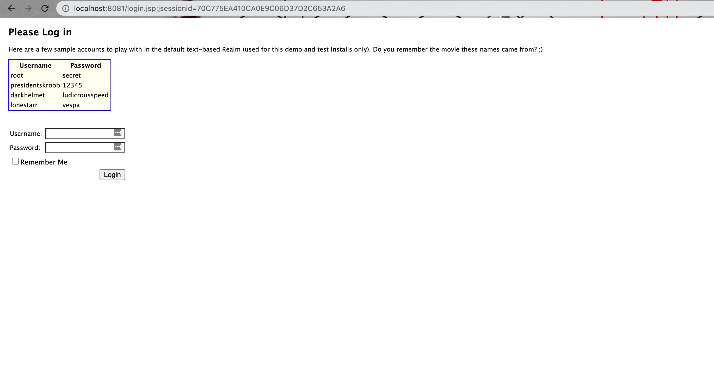

登陆时勾选RememberMe

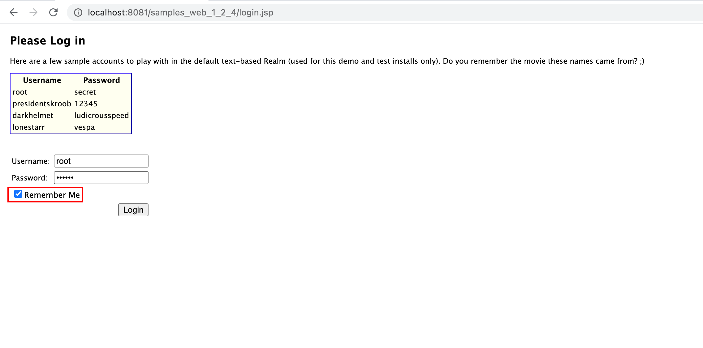

登陆后会设置相应Cookie，其中一个字段rememberMe有一串数值

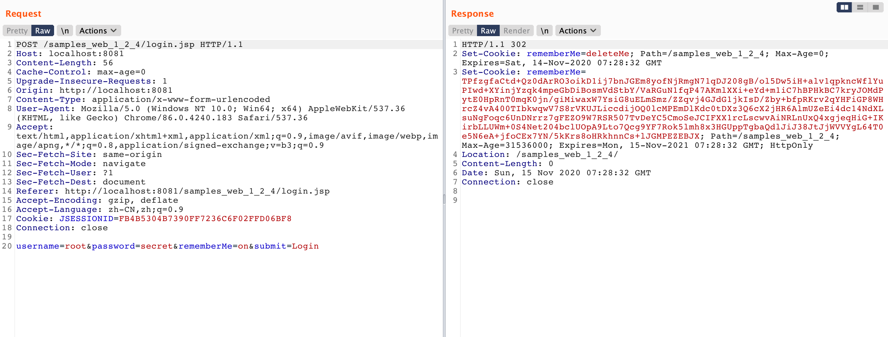

在登陆回调上打断点 `org/apache/shiro/mgt/DefaultSecurityManager.class`，跟踪整个流程

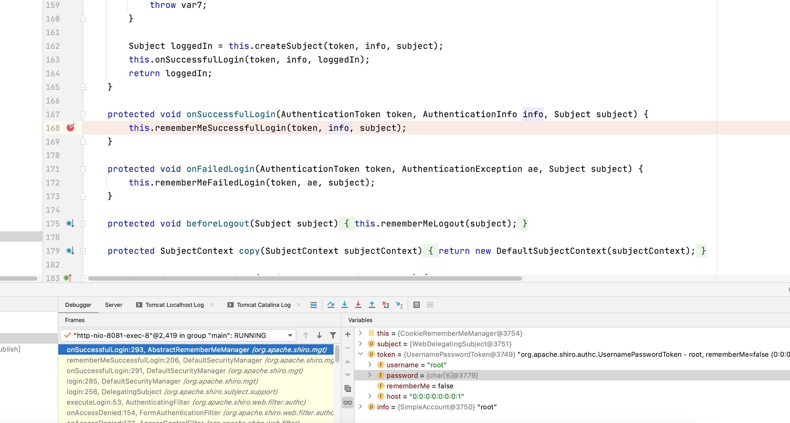

当RememberMe设置项为True时，进入`this.rememberIdentity`分支

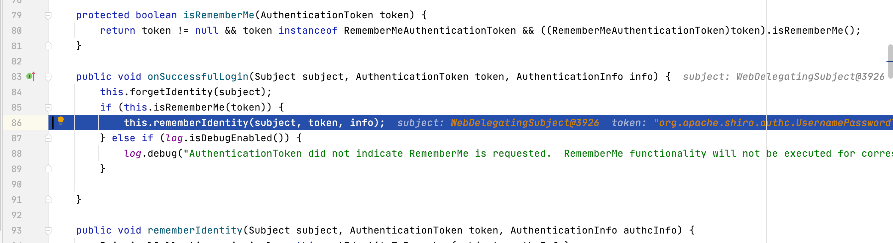

在这一分支中，会将身份序列化，之后把它AES加密后保存在rememberMe中

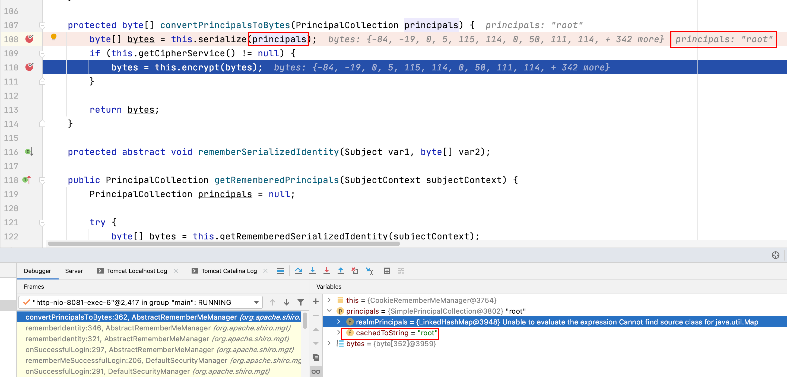

跟进`this.encrypt`

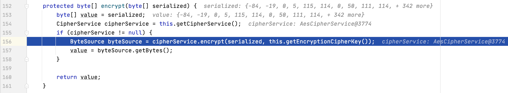

这里的AES密钥默认情况下是固定值

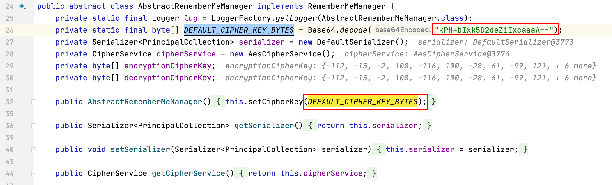

如果不使用`setCipherKey`设置，默认密钥的Base64编码值为`kPH+bIxk5D2deZiIxcaaaA==`

在设置RememberMe之后，即使不携带`JSESSION_ID`，也能够完成身份认证

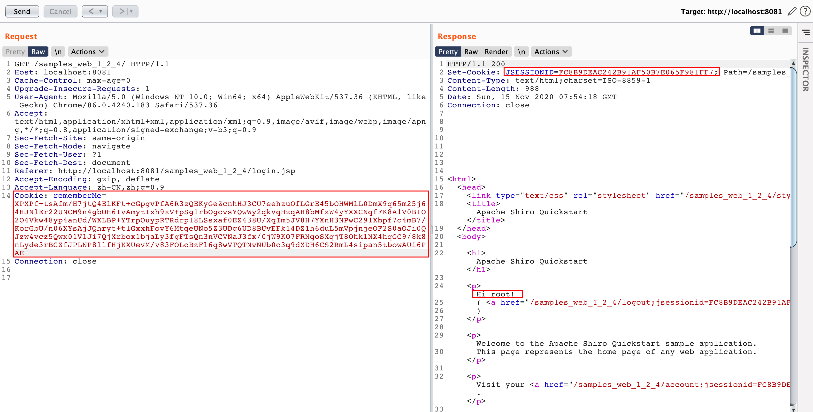

带好rememberMe即可，服务端会返回一个新的JSESSIONID

在这一过程中必然会涉及反序列化，如果用户在RememberMe中提供了恶意代码，就能够攻击服务器。继续跟代码，看一下反序列化的具体过程。

已知在反序列化过程中一定会使用密钥，将断点打在`AbstractRememberMeManager`的各个方法上，携带RememberMe数据请求，最终触发断点，查看调用栈后决定从`DefaultSecurityManager`入手开始跟进 `org/apache/shiro/mgt/DefaultSecurityManager.class`

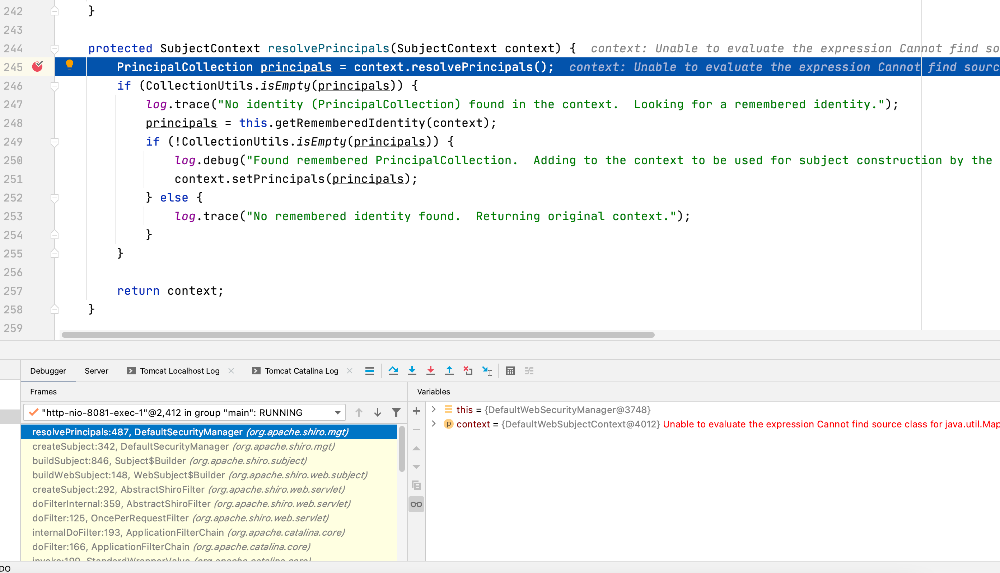

具体处理逻辑在`SimpleCookie.class`中

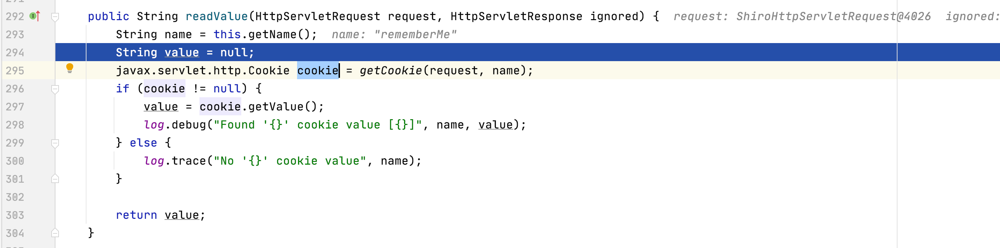

取到RememberMe的值并解码，之后从中还原出Principal

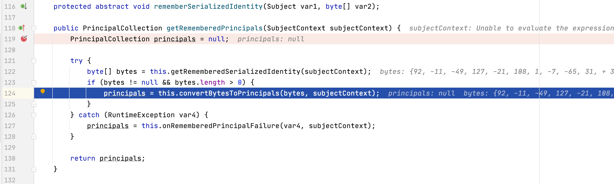

在这里进行反序列化

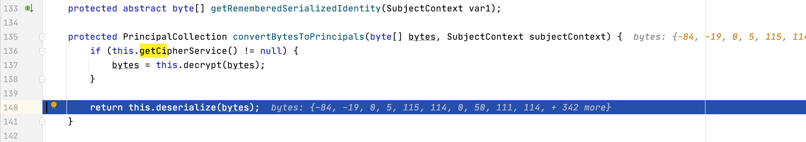


使用`DefaultSerializer`进行反序列化

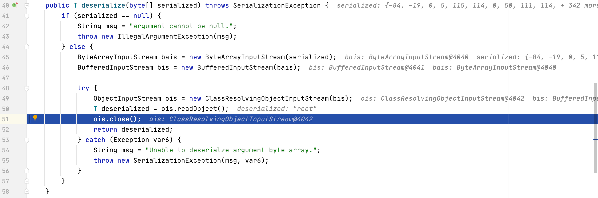

接下来只需要找到一条可用的gadget，就能够完成命令执行。在Shiro中默认会使用`Commons-collections-3.2.1`，原生条件下直接利用会有些问题，但在[这里](https://www.buaq.net/go-16390.html)找到一条优化后的Exploit（ysomap项目看起来不错，需要之后详细分析下），编译ysoserial需要jdk1.7

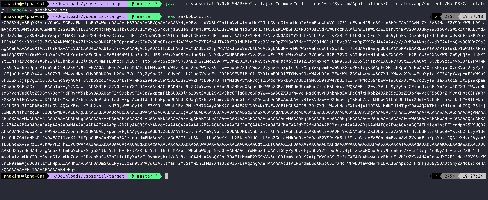

拿到payload之后，需要将其base64.decode之后再用AES加密，逻辑也很好写，直接在源码中挖出来即可：

```java
package com.fakestudio;

import org.apache.shiro.codec.Base64;
import org.apache.shiro.crypto.AesCipherService;
import org.apache.shiro.crypto.CipherService;
import org.apache.shiro.util.ByteSource;

public class Main {

    CipherService cipherService = new AesCipherService();


    public static void main(String[] args) {
        byte[] exp = Base64.decode("rO0ABXNyABFq...."); // 此处省略payload
        CipherService cipherService = new AesCipherService();
        byte[] DEFAULT_CIPHER_KEY_BYTES = Base64.decode("kPH+bIxk5D2deZiIxcaaaA=="); // 默认密钥

        ByteSource byteSource = cipherService.encrypt(exp, DEFAULT_CIPHER_KEY_BYTES);
        byte[] value = byteSource.getBytes();


        System.out.println(Base64.encodeToString(value));

    }
}

```

丢到rememberMe中即可触发反序列化：

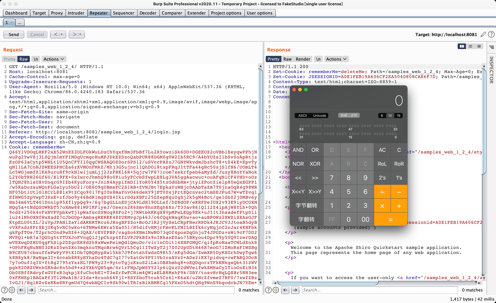

### 漏洞修复

Shiro-550的修复是去除了硬编码的默认密钥，由上述分析可知，只要知道了AES加密的密钥，就能够继续构造rememberMe的数据，依然能够进行反序列化。在GitHub进行搜索，可以找到很多硬编码的CipherKey，其中不乏一些用户广泛的开源库，一旦这些代码被其他用户使用，就会带来安全问题。例如：

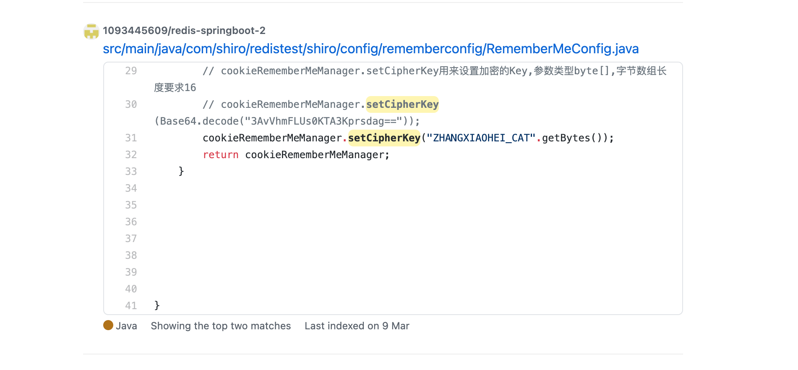

一些利用工具会集成已经搜集到 的CipherKey，以求攻击成功率的最大化

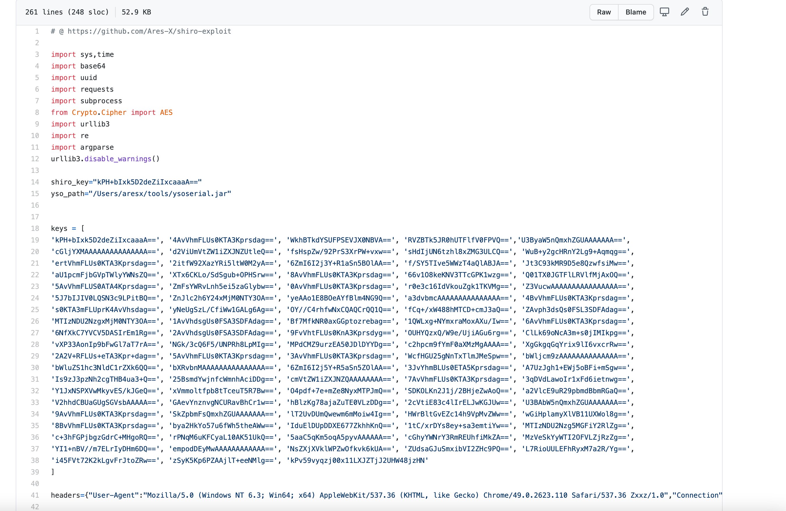

### 参考

* https://www.buaq.net/go-16390.html

### Shiro-721

TODO