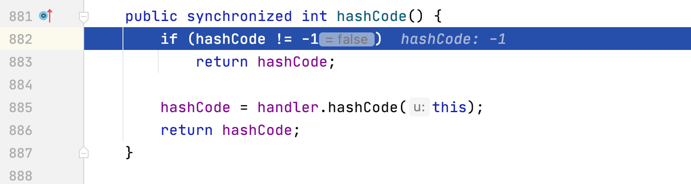

分析下Ysoserial中的Payload，首先从最简单的URLDNS开始。相关的文件在`ysoserial/payloads/URLDNS.java`中。注释中可以找到链的调用过程

```
 *   Gadget Chain:
 *     HashMap.readObject()
 *       HashMap.putVal()
 *         HashMap.hash()
 *           URL.hashCode()
```

主要分析该工具`getObject`函数返回的对象在返回之前到底做了哪些事情


这里返回的类是HashMap，因此在反序列化时一定会调用HashMap的`readObject`函数


使用ysoserial生成payload，手工反序列化触发并调试


跟进putVal


跟进hash(key)


进入key.hashCode()



这里有个技巧是，在生成序列化数据的时候，ysoserial设置了hashCode的值为-1，这样能够保证URL的Hash不被缓存，从而每次都被触发，继续跟进到getHostAddress中


在这里会触发DNS请求


在DNSLOG中可以看到相应的记录


这条链总体很清楚，而且只借助JDK自身的类就能够完成，可以用来探测反序列化行为是否存在