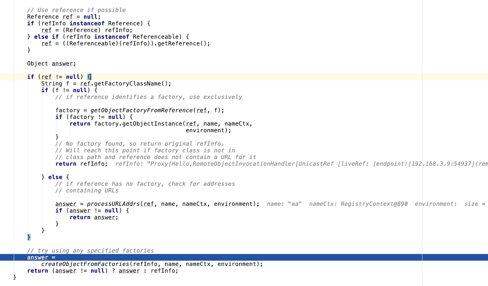

在整理反序列化问题时对RMI相关的问题还是没有想清楚，单独开一篇记录下调试过程

需要解决的关键问题：

1. RMI上绑定的Remote Object和Reference有什么区别
2. 数据如何传输
3. 为什么在JNDI注入时客户端查询到恶意类的Reference后，会在RMI客户端执行命令，而非RMI服务端

查了很多（二手）材料，发现没人能清楚的解答我的问题

最佳参考材料：[官方文档](https://docs.oracle.com/javase/jndi/tutorial/objects/storing/remote.html)

## JNDI

信息来源：[官方文档](https://docs.oracle.com/javase/tutorial/jndi/overview/index.html)

JNDI其实是Java为需要提供**命名和目录**服务的程序提供的接口，是在具体的服务提供者上做的一层抽象。


Naming service 和 directory service在wiki上其实是同义词，都指一种通过名称查询具体值的服务

JNDI的作用就是让上方的调用者只需要调用JNDI API，而不需要关心后端到底是由谁提供了具体的Naming and directory服务。具体的调用由JNDI SPI完成（Service Provider Interface）

## RMI

从图上可以看出，RMI其实是一种具体的Service Provider，RMI是为了让一个JVM上的对象调用到另一个JVM的方法而创造的一种机制。

在调用远程方法时，自然会涉及参数传递和结果传回，RMI的具体机制为：参数被序列化后传到远程JVM，之后参数被反序列化并使用，而方法执行的结果则被序列化后发送给调用方的JVM。

之前已经测试过使用Reference时会造成Client命令执行，这次只调试下使用Remote Object会发生什么

Reference是JNDI对RMI的扩展，因此这里的Client是调用了JNDI的接口

RMI-Client测试代码：

```java
// Main.java
public static void main(String[] args) throws NamingException, RemoteException {
        // client
        // lookup for Hello Class and invoke remote method
        Hashtable env = new Hashtable();
        env.put(Context.INITIAL_CONTEXT_FACTORY, "com.sun.jndi.rmi.registry.RegistryContextFactory");
        env.put(Context.PROVIDER_URL, "rmi://127.0.0.1:1099");
        System.getProperties().setProperty("com.sun.jndi.rmi.object.trustURLCodebase", "true");
        System.getProperties().setProperty("com.sun.jndi.ldap.object.trustURLCodebase", "true");
        String uri = "rmi://127.0.0.1:1099/aa";
        Context ctx = new InitialContext(env);
        Hello obj = (Hello) ctx.lookup(uri);
        System.out.println(obj.sayHello());

    }
```

在RMI-Client需要远程对象的接口

```java
// Hello.java
import java.rmi.Remote;
import java.rmi.RemoteException;

public interface Hello extends Remote {
    public String sayHello() throws RemoteException;
}

```

RMI-Server的测试代码

```java
// Main.java
public static void main(String[] args) throws Exception {
        Registry registry = LocateRegistry.createRegistry(1099);
        HelloImpl h = new HelloImpl();
        registry.bind("aa", h);
    }
```

RMI-Server中有Hello接口的具体实现，也就是`HelloImpl`

```java
import java.rmi.RemoteException;
import java.rmi.server.RMISocketFactory;
import java.rmi.server.UnicastRemoteObject;

public class HelloImpl extends UnicastRemoteObject implements Hello {
    /**
     * Creates and exports a new UnicastRemoteObject object using an
     * anonymous port.
     *
     * <p>The object is exported with a server socket
     * created using the {@link RMISocketFactory} class.
     *
     * @throws RemoteException if failed to export object
     * @since JDK1.1
     */
    protected HelloImpl() throws RemoteException {
    }

    public String sayHello() throws RemoteException {
        System.out.println("hi");
        return ("Hello, the date is " + new java.util.Date());
    }
}
```

开启RMI-Server，之后启动RMI-Client，此时RMI-Client会来Server取Remote Object，并且调用`sayHello`方法，最直观的感受就是在RMI-Server上打印出了`Hi`字样，说明方法是在RMI-Server执行的


而在RMI-Client获取到了sayHello方法的返回值（序列化执行结果后返回数据给Client）


因此差异是：Remote Object在`/Library/Java/JavaVirtualMachines/jdk1.8.0_192.jdk/Contents/Home/src.zip!/javax/naming/spi/NamingManager.java`这里会跳过`getObjectFactoryFromReference`的方法，而Reference则会走到这个分支

也就是说，Remote Object在调用时方法是在RMI Server执行的，而Reference是会根据地址取出ObjectFactory类，并且在Client实例化。这样就造成在处理Reference时RMI Client会执行命令



测试代码：https://github.com/miaochiahao/rmi-test-code

另外，Remote Object与Client的通信具体过程其实是先由RMI-Server返回给Client一个代理（Stub），Client调用远程对象时都是通过Stub进行的，Stub封装了具体的通信细节，让调用远程方法就像调用本地方法一样